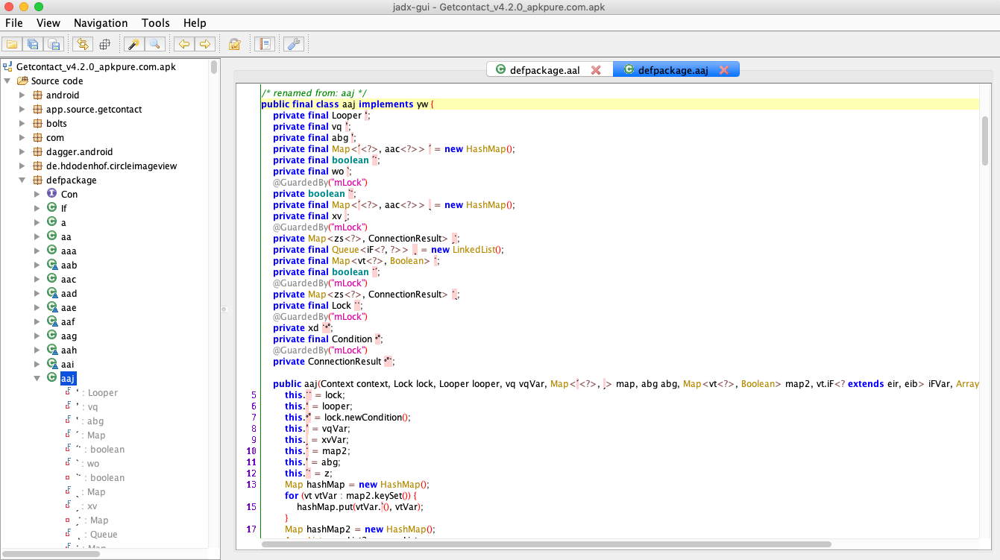

<!-- MarkdownTOC -->

- Main\(\)
    - Traffic
    - Encryption
    - Signature
    - Tools

<!-- /MarkdownTOC -->


# Main()

Here you will find some details about reverse engineering of `app.source.getcontact` Android application 


## Traffic

Didn't notice any working SSL pinning mechanism. Just install Burp's certificate in an Android Device.

You will find traffic example in [requests.md](requests.md) 
Ok, obviously data in POST requests is:

1. encrypted 
`{"data":"it1BCQGnv+A3i6FmRigzviBGSJqF58K42YBCMtDP53fvMH/bJO4XZnXlDEC3AZWYSGGBpZgRv21LcNvgaP94gA64L4BbqgE7dzHW0vXK5Ql8vBrtqZiWEfZ+aXHDWydQok/mYnMTfYNDxySkGGUez2qwL4mLIR7yelOlQQ9sup0="}`

2. signed   
`X-Req-Signature` header

Let's decompile the application.

 

It seems that the obfuscator worked here :/
Let's drill it.


## Encryption

`ᔮ` class is responsible for encryption:

```java
    public final String ˋ(String str) {
        int i = 2 % 2;
        String str2 = "";
        try {
            Key secretKeySpec = new SecretKeySpec(aj.ˋ(this.ʻ), ᔮ.ˊ(172, 3, 58400).intern());
            Cipher instance = Cipher.getInstance(ᔮ.ˊ(172, 3, 58400).intern());
            instance.init(1, secretKeySpec);
            str2 = fyn.ˎ(instance.doFinal(str.getBytes()));
        } catch (Throwable e) {
            e.printStackTrace();
        } catch (Throwable e2) {
            e2.printStackTrace();
        } catch (Throwable e22) {
            e22.printStackTrace();
        } catch (Throwable e222) {
            e222.printStackTrace();
        } catch (Throwable e2222) {
            e2222.printStackTrace();
        }
        i = ˏॱ + 45;
        ॱˊ = i % 128;
        if (i % 2 != 0) {
        }
        return str2;
    }
```


Let's check the encryption algorithm. 
The easiest way to get algorithm (and other stuff from app) is using [frida](https://www.frida.re/) toolkit
Below you will find `frida` script for that:

```javascript
Java.perform(function x() { 
    console.log("Decrypt strings")
    var instance = Java.use("ᔮ");
    var result = instance.ˊ(172, 93 String.fromCharCode(58400));
    console.log("Result: " + result)
});
```

```
Result: AES
```


OK, we have to find encryption key. And again `frida` helps:

```javascript
Java.perform(function x() { 
    console.log("\nGetting AES key:")
    var instance = Java.use("ᔮ");
    var result = instance.ॱ().ʻ.value;
    console.log("Result: " + result)
});
```


So, know we can try to decrypt data from intercepted traffic:

```python
def decrypt_aes(payload):
    logger.debug("Decrypting...\nDATA:{}".format(payload.encode("hex")))
    cipher = AES.new(AES_key, AES.MODE_ECB)
    rez =  unpad(cipher.decrypt(payload))
    logger.debug("Decrypted result:{}".format(rez))
    return rez
```

```
➜ python getcontact.py -D "it1BCQGnv+A3i6FmRigzviBGSJqF58K42YBCMtDP53fvMH/bJO4XZnXlDEC3AZWYSGGBpZgRv21LcNvgaP94gA64L4BbqgE7dzHW0vXK5Ql8vBrtqZiWEfZ+aXHDWydQok/mYnMTfYNDxySkGGUez2qwL4mLIR7yelOlQQ9sup0="

Decrypted: {countryCode:US,phoneNumber:+79040991328,source:detail,token:AxPu569b72d9c908520b95408e6e95b5482c8995fd98b0e794a2e516a3d1}
```

It works!
Let's move to the signature.

## Signature

We have to sign our requests and for that have to send calculated HMAC value in `X-Req-Signature` header:

```
 POST /v2.1/number-detail HTTP/1.1
X-App-Version: 4.2.0
X-Req-Timestamp: 1547742064906
X-Os: android 7.1.1
X-Token: AxPu569b72d9c908520b95408e6e95b5482c8995fd98b0e794a2e516a3d1
X-Encrypted: 1
X-Client-Device-Id: 37b6dc0c3cb9a596
X-Req-Signature: Zh5yxvtGLAEaMJ13M0eUS99dT0TQGE5h8qqIjQtH/zo=
Content-Type: application/json; charset=utf-8
Content-Length: 205
Host: pbssrv-centralevents.com
Connection: close
Accept-Encoding: gzip, deflate

{"data":"it1BCQGnv+A3i6FmRigzviBGSJqF58K42YBCMtDP53fvMH/bJO4XZnXlDEC3AZWYSGGBpZgRv21LcNvgaP94gA64L4BbqgE7dzHW0vXK5Ql8vBrtqZiWEfZ+aXHDWydQok/mYnMTfYNDxySkGGUez2qwL4mLIR7yelOlQQ9sup0="}
 ```


Class responsible for that is `冖`

```java
public final class 冖 implements fms {
    public final fne ˏ(ˋ ˋ) {
        byte[] bArr;
        fmw ˊ = ˋ.ˊ();
        fnc fnc = ˊ.ॱ;
        Object fpj = new fpj();
        fnc.ˎ(fpj);
        String ˊॱ = fpj.ˊॱ();
        eqi.ॱ("Plain Body".concat(String.valueOf(ˊॱ)));
        String str = ᔮ.ॱ().ʼ;  <--- secret key
        ˊॱ = new StringBuilder().append(fmu.ˊ(ˊ.ˋ.ॱ, "X-Req-Timestamp")).append("-").append(ˊॱ).toString().replace("\\/", "/"); <--- string to hash
        eqi.ॱ("String to hash".concat(String.valueOf(ˊॱ)));
        fyo fyo = new fyo(fyp.HMAC_SHA_256, str);
        str = ˊॱ;
        Mac mac = fyo.ॱ;
        ˊॱ = str;
        Charset charset = fyl.ᐝ;
        if (ˊॱ == null) {
            bArr = null;
        } else {
            bArr = ˊॱ.getBytes(charset);
        }
        If ˏ = new If(ˊ).ˏ("X-Req-Signature", fyn.base64(mac.doFinal(bArr)).trim());
        if (ˏ.ˏ != null) {
            return ˋ.ˊ(new fmw(ˏ));
        }
        throw new IllegalStateException("url == null");
    }
}
```


So, because it's `HMAC_SHA_256` we have to know the key.
Below you will find `frida` script for that

```javascript
Java.perform(function x() { 
    console.log("Getting HMAC key...")
    var instance = Java.use("ᔮ");
    var result = instance.ॱ().ʼ.value;
    console.log("Result: " + result)
});
```

So, we've got it:

`HMAC_key = 2Wq7)qkX~cp7)H|n_tc&o+:G_USN3/-uIi~>M+c ;Oq]E{t9)RC_5|lhAA_Qq%_4`


If you noticed data json contains `token`. It's something like user session. You can get your token value using this `frida` script:

```javascript
Java.perform(function x() { 
    console.log("Getting user token...")
    var instance = Java.use("ᒨ");
    var result = instance.ˋ();
    console.log("Result: " + result)
});
```


Finally! Now we can sign our requests:

```python
def create_sign(timestamp, payload):
    logger.debug("Signing...\n{}-{}".format(timestamp, payload))
    message = bytes("{}-{}".format(timestamp, payload))
    secret = bytes(HMAC_key)
    signature = base64.b64encode(hmac.new(secret, message, digestmod=hashlib.sha256).digest())
    logger.debug("Result: {}".format(signature))
    return signature
```


That's all folks!
We can encrypt/decrypt data and sign request.

## Tools

Please find [frida script](get_keys_and_token_frida.js) that allows you to get all necessary values from Android Application   


```
➜ frida -U -l get_keys_and_token_frida.js --no-paus -f app.source.getcontact
     ____
    / _  |   Frida 12.2.29 - A world-class dynamic instrumentation toolkit
   | (_| |
    > _  |   Commands:
   /_/ |_|       help      -> Displays the help system
   . . . .       object?   -> Display information about 'object'
   . . . .       exit/quit -> Exit
   . . . .
   . . . .   More info at http://www.frida.re/docs/home/
Spawned `app.source.getcontact`. Resuming main thread!
[Android Emulator 5554::app.source.getcontact]->
Getting AES key:
Result: 0705a53f0b0c1fbe14d68313939c6683f2baa687aff535dd2469291834bff606
Getting HMAC key...
Result: 2Wq7)qkX~cp7)H|n_tc&o+:G_USN3/-uIi~>M+c ;Oq]E{t9)RC_5|lhAA_Qq%_4
Getting user token...
Result: AxPu569b72d9c908520b95408e6e95b5482c8995fd98b0e794a2e516a3d1
```
